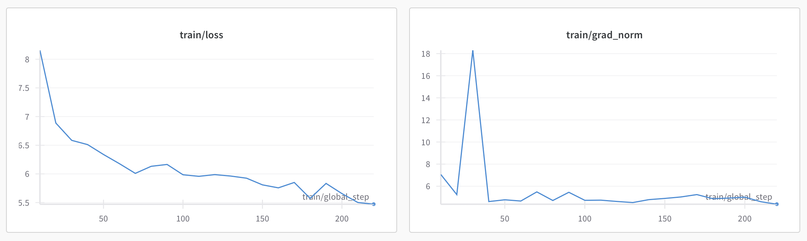

# 🛠️ Red Russian Gemma (WIP)

## Overview

This project fine-tunes a Gemma language model using PEFT and LoRA on [this dataset](https://www.kaggle.com/datasets/qmarva/red-russian). 

This is a dataset of texts by communist authors of the Soviet era. Everything is in Russian language. 

The goal is to generate text that reflects general communistic patterns (and writing styles of any of these author) in writing speech. 

## To Do

- [ ]  Upload .ckpt model
- [ ]  Upload python files
- [ ]  Add markdown comments to [notebook](red-russian-gemma-lora-hf.ipynb)
